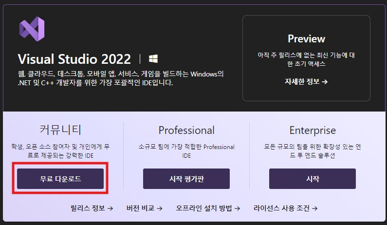
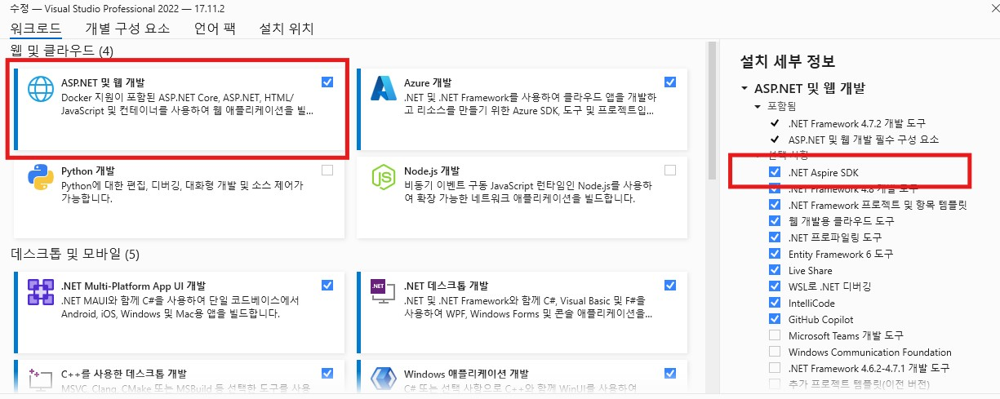
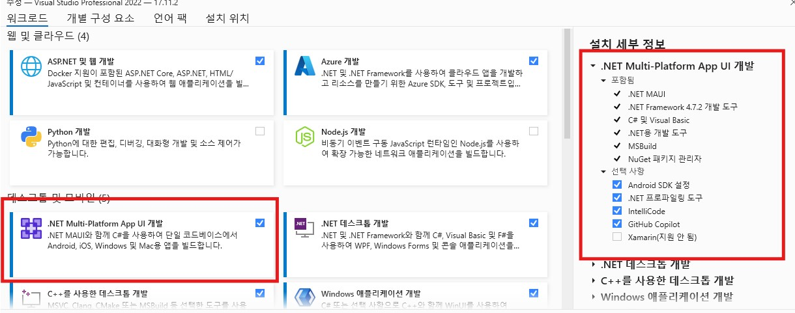
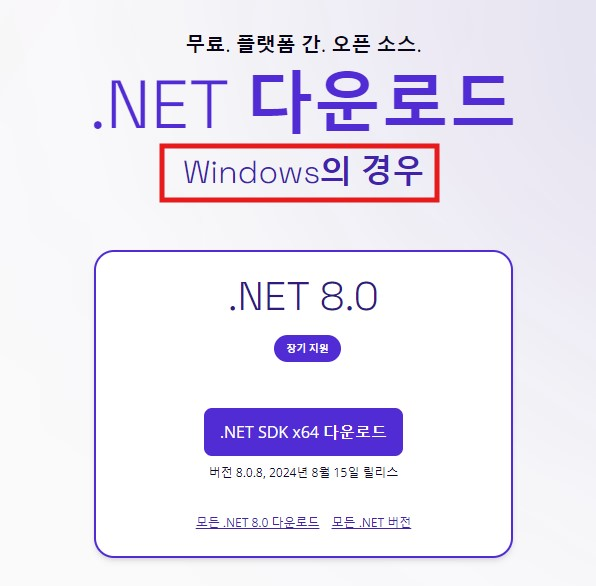
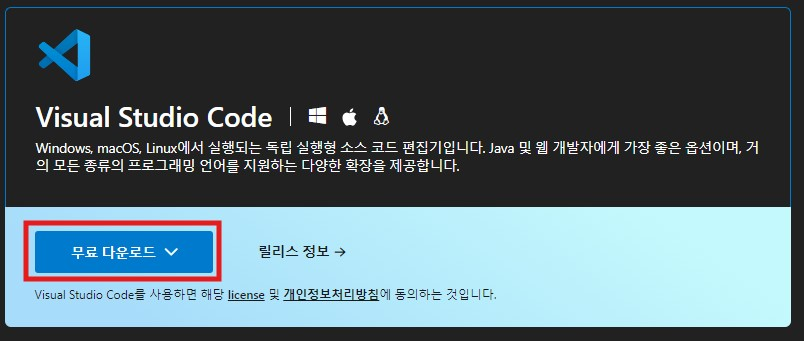

# 사전 설치 준비 요소

## 공통 요소

### Windows
- [Visual Studio 2022](https://visualstudio.microsoft.com/ko/downloads/)
>- 커뮤니티 버전으로 설치   
>

>- 워크로드 선택   
>   
>

### Visual Studio Code
VS CODE 설치 매뉴얼

### macOS
-[.NET 8.0 SDK](https://dotnet.microsoft.com/ko-kr/download)
>- macOS인지 확인해 주시고 아니면 [전체 다운로드 페이지](https://dotnet.microsoft.com/ko-kr/download/dotnet/8.0)에서 적절한 SDK를 설치해 주세요.   
>   

-[Visual Studio Code](https://visualstudio.microsoft.com/ko/downloads/)
>- OS에 맞게 설치   
>

VS CODE 확장 설치
- [C# Dev Kit](https://marketplace.visualstudio.com/items?itemName=ms-dotnettools.csdevkit)
- [REST Client](https://marketplace.visualstudio.com/items?itemName=humao.rest-client)

## Blazor를 위한 추가요소
- 없음

## Backend & Aspire를 위한 추가요소
- VS Code 확장
>- [REST Client](https://marketplace.visualstudio.com/items?itemName=humao.rest-client)
>- [Docker Desktop](https://www.docker.com/products/docker-desktop/)
>>- 설치가 어려우면 준비된 Azure 클라우드를 이용하여 워크샵을 진행하실 수 있습니다.

## Uno-Platform를 위한 추가요소
```
dotnet new install Uno.ProjectTemplates.Dotnet
```
[README.md](https://github.com/blazorstudy/bicycle-sharing-system-workshop/tree/main/sessions/3.%20uno-platform)
## Avalonia를 위한 추가요소

### Rider 진행 시 (맥 또는 윈도우)
- Avalonia Template 설치
- 플러그인(AvaloniaRider) 설치
```csharp
dotnet new install Avalonia.Templates
```

### VisualStudio 진행 시 (윈도우) 
- 확장도구(Avalonia for Visual Studio 2022) 설치

### BMW Bicycle Kiosk Project Template DownLoad
```csharp
dotnet new install BicycleSharingAvalonia.Template
```
## MAUI를 위한 추가요소
- [ngrok Client](https://ngrok.com/download)
>- 해당 페이지에서 회원가입과 각 플랫폼(주로 윈도우)에 맞는 클라이언트를 설치해주시면 localhost 상태의 API와 에뮬레이터를 연결 시킬 수 있습니다

