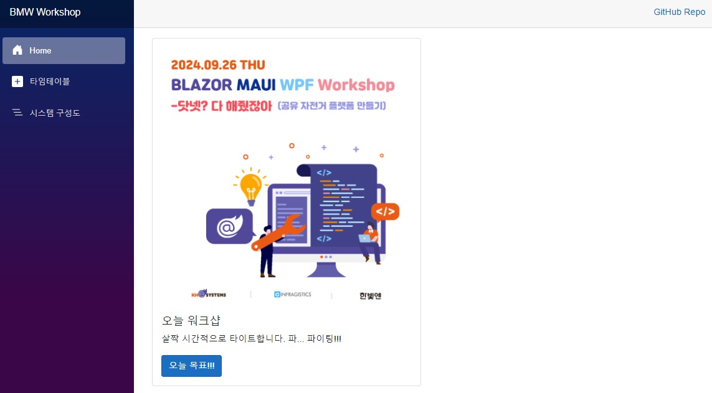

# 01. Blazor Sesson

## 세션 목표
- Blazor로 웹페이지를 만들어봅니다.
- Blazor의 rendermode에 대해서 이해합니다.
- Blazor에 아주 간단한 C# code를 작성해 봅니다.
- 오늘 워크샵에서 무슨 개발을 하게 되는지 알아봅니다.
- vscode에서도 개발하는 방법을 이해합니다.

## 세션 준비하기
1. Workshop Repo에서 sessions > 1.blazor > start 폴더의 BicycleSharingSystem.WebPage.sln를 Visual Studio로 여세요.
  >- 더블클릭하시면 됩니다.
  >- F5를 누르시면 웹사이트를 확인하실 수 있습니다.

2. Visual Studio Code로 하실 때엔 해당 폴더를 여세요.
  >- 파일 > 폴더 열기
  >- 터미널에서 아래 명령어로 확인하실 수 있습니다. (start 폴더에서 실행하셔야 합니다.)
  ```
  dotnet watch
  ```

## 메인 페이지 만들기
1. 먼저 첫 화면을 변경하기 위해 Components/Pages/Home.razor 파일의 html 부분을 변경합니다.
```html
<PageTitle>Home</PageTitle>

<div style="display: flex">
    <div class="card" style="width: 30rem;">
        
        <div class="card-body">
            <h5 class="card-title">오늘 워크샵</h5>
            <p class="card-text">살짝 시간적으로 타이트합니다. 파... 파이팅!!!</p>
            <button class="btn btn-primary" @onclick="clickGoal">오늘 목표!!!</button>
        </div>
    </div>

    @if( isDisplay == true )
    {
        <div class="card" style="width: 35rem;">
            <div class="card-body">
                <h5 class="card-title">오늘 의 목표</h5>
                <p class="card-text">
                    <h5>.NET으로 할수 있는 다양한 개발 방법을 체험해 보자</h5>
                    <ul>
                        <li>Blazor</li>
                        <li>Backend and Aspire</li>
                        <li>Uno-Platform</li>
                        <li>Avalonia</li>
                        <li>MAUI</li>
                    </ul>
                    <h5>오늘은 맛보기만 해도 충분해요!</h5>
                </p>
            </div>
        </div>
    }
</div>

```
2. 버튼을 누르면 동작할 코드를 추가합니다.
```cs
@code 
{
    private bool isDisplay = false;
    private void clickGoal()
    {
        isDisplay = !isDisplay;
        Console.WriteLine($"오늘 워크샵 목표를 클릭했습니다.[{isDisplay}]");
    }
}
```

3. 이제 화면을 확인합니다. "오늘의 목표!!!" 버튼을 클릭해도 아무런 반응이 없는 것을 확인할 수 있습니다.

4. 의도대로 동작하도록 렌더모드를 추가합니다.
```cs
@rendermode InteractiveServer
```

5. 오늘 워크샵의 목표가 토글처럼 표시되는 것을 확인할 수 있습니다.

6. 조금 더 확인해 볼 내용
>- 콘솔 메시지가 표시되는 위치 : VS, VS Code로 개발하는 상황에 따라 메시지 확인, Server이기 때문에 콘솔에 표시
>- VS Code로 디버깅하는 방법

## 타임테이블 페이지 만들기
1. 새로운 페이지를 추가하여 오늘의 워크샵 타임 테이블을 확인해 보겠습니다.
>- 타임테이블은 Blazor QuickGrid Component를 이용합니다.
>- Table 태그를 이용해도 되지만 Nuget 패키지를 이용하여 사용하는 경험을 해보고 싶습니다.

2. Nuget 패키지를 추가합니다.
>- Visual Studio의 경우 도구 > Nuget 패키지 관리자 > 솔루션용 NuGet 패키지 관리... 메뉴에서 Microsoft.AspNetCore.Components.QuickGrid를 설치합니다.
>- VS Code의 경우 아래 명령어를 이용하세요.
```
dotnet add package Microsoft.AspNetCore.Components.QuickGrid --version 8.0.8
```

3. Components/Pages에 TimeTable.razor 파일을 추가합니다.

4. TimeTable.razor 파일 내용을 아래와 같이 바꾸어 주세요.
```html
@page "/timetable"
@rendermode InteractiveServer
@using Microsoft.AspNetCore.Components.QuickGrid

<PageTitle>BMW Workshop 2024</PageTitle>

<h3>오늘 워크샵 시간표</h3>

<QuickGrid Items="sessions" >
    <PropertyColumn Property="@( s => s.Time )" Format="HH:mm"  Sortable="true" />
    <PropertyColumn Property="@( s => s.Subject )" Sortable="true" />
    <PropertyColumn Property="@( s => s.Speaker )" Sortable="true" />
</QuickGrid>

@code {
    private record Session(TimeOnly Time, string Subject, string Speaker);

    private IQueryable<Session> sessions = new []
    {
        new Session(new TimeOnly(10, 0), "오프닝, 후원사 소개", "김진석, 유현아"),
        new Session(new TimeOnly(10, 20), "Blazor", "김진석"),
        new Session(new TimeOnly(11, 0), "Backend & Aspire", "박구삼"),
        new Session(new TimeOnly(12, 0), "점심시간", ""),
        new Session(new TimeOnly(12, 45), "Uno-Platform", "이재웅"),
        new Session(new TimeOnly(14, 25), "Avalonia", "이광석"),
        new Session(new TimeOnly(15, 35), "MAUI", "조장원"),
        new Session(new TimeOnly(17, 10), "클로징, 경품추첨, 기념사진", "김진석, 조동수"),
    }.AsQueryable();
}
```

5. 꼭 알고 넘어가야 할 것들
>- @page 지시어로 razor 페이지의 경로를 지정할 수 있습니다.
>- @using 지시어를 사용할 네임스페이스를 지정할 수 있습니다.
>- 점심은 인프라지스틱스에서 햄버거와 음료수를 제공합니다. 
>- 모든 세션이 끝나고 경품추첨과 기념사진이 있습니다.

## 워크샵 구성도 페이지 만들기
1. 새로운 페이지를 추가해서 오늘 워크샵에서 만드는 시스템에 대한 내용을 이해해 보겠습니다.

2. Components/Pages에 Arch.razor 파일을 추가합니다.

3. Arch.razor 파일 내용을 아래와 같이 바꾸어 주세요.
```html
@page "/system"

<h3>오늘 개발 시스템 구성</h3>


```

4. 꼭 알고 넘어가야 할 것들
>- VS Code의 경우 솔루션 확장을 통해 새파일을 만들어도 되고 간단한 것은 그냥 만들어도 됩니다.
>- Backend 세션이 어려워 따라하지 못 했거나 Aspire나 Docker 등을 띄우고 세션을 진행하기 어려운 경우 준비된 Azure Backend를 사용하시면 됩니다.

## Resources
- [Blazor 공식 페이지](https://dotnet.microsoft.com/ko-kr/apps/aspnet/web-apps/blazor)
- [QuickGrid Component](https://learn.microsoft.com/ko-kr/aspnet/core/blazor/components/quickgrid?view=aspnetcore-8.0&tabs=visual-studio)
