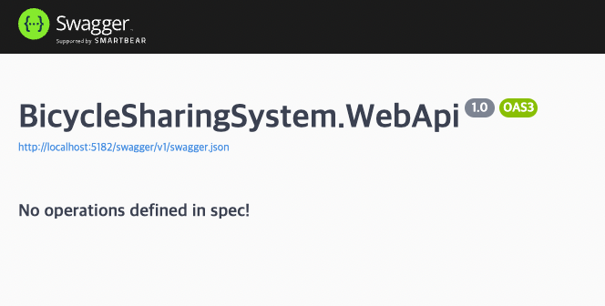
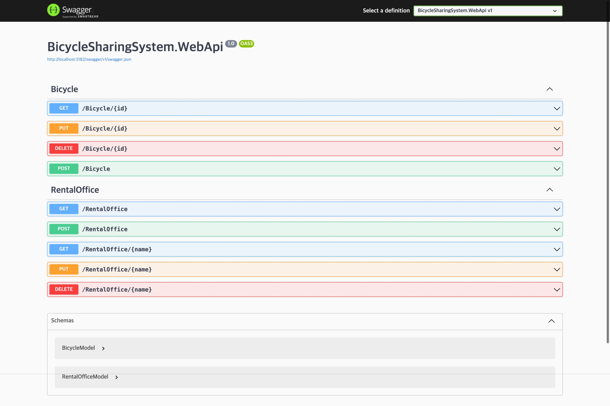
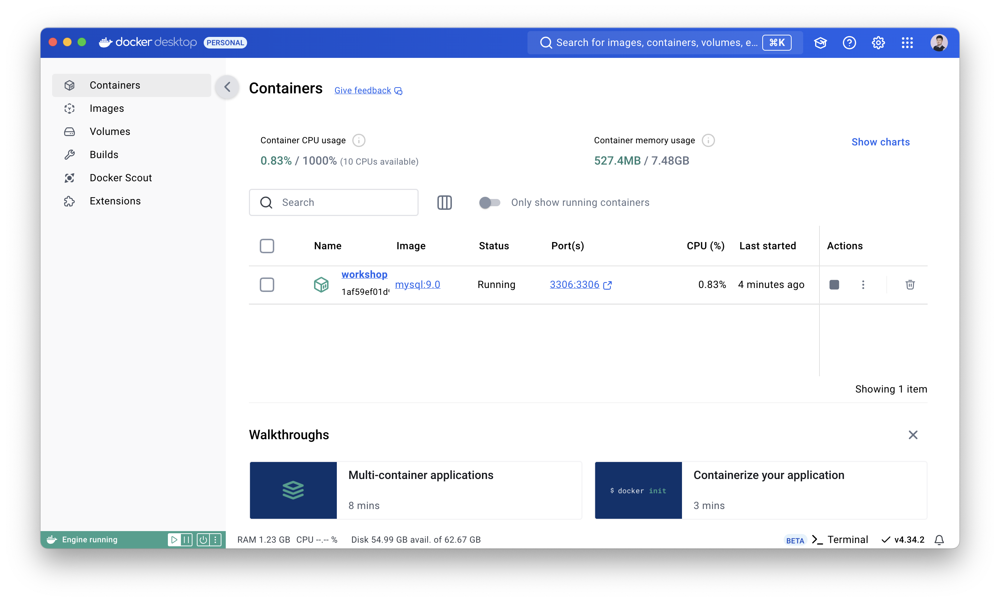
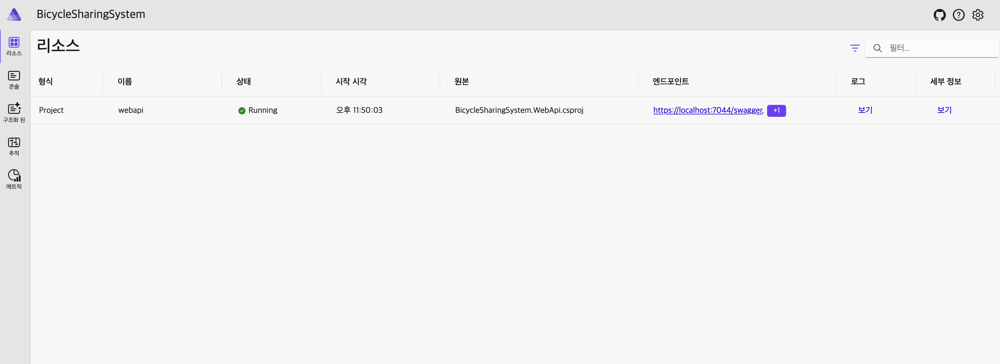
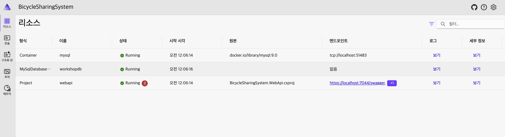

# 02. Backend with .NET Aspire!

## 세션 목표

* ASP.NET Core로 Backend API 서버를 만들어봅니다.
* Docker에 MySQL 컨테이너를 생성해봅니다.
* 개발을 간단하게 만들어주는 .NET Aspire에 대해 알아봅니다.


## 세션 준비

1. 오늘 이 시간에는 Visual Studio Code를 이용합니다.
1. [Prerequisites](../0.%20prerequisites/readme.md)에 나온 확장 도구와 Docker를 설치합니다.
    * [C# Dev Kit](https://marketplace.visualstudio.com/items?itemName=ms-dotnettools.csdevkit)
    * [REST Client](https://marketplace.visualstudio.com/items?itemName=humao.rest-client)
    * [Docker Desktop](https://www.docker.com/products/docker-desktop/)
1. 오늘 실습할 디렉토리는 [start](./start) 입니다.

> 📍 만약 이 단계를 마무리하지 못했더라도 괜찮아요!
> 저희가 실습을 따라할 수 있도록 공개 API 서버를 워크샵 기간동안 운영하고 있습니다!
> https://ame.ac


---


## 차례

1. [Backend API Server 만들기](#backend-api-server-만들기)
1. [대여소와 자전거 모델 만들기](#대여소와-자전거-모델-만들기)
1. [대여소와 자전거의 CRUD Controller 만들기](#대여소와-자전거의-crud-controller-만들기)
1. [MySQL 컨테이너 생성하고 연결하기](#mysql-컨테이너-생성하고-연결하기)
1. [.NET Aspire 시작하기](#net-aspire-시작하기)
1. [.NET Aspire에 MySQL 관리하도록 만들기](#net-aspire에-mysql-관리하도록-만들기)


---


## Backend API Server 만들기

1. 아래 명령어를 입력하여 `BicycleSharingSystem.WebApi`라는 이름으로 `WebApi` 폴더에 새 프로젝트를 생성합니다.

    ```sh
    dotnet new webapi -n "BicycleSharingSystem.WebApi" -o WebApi
    ```

1. 그리고 솔루션 파일을 만들고 방금 만든 프로젝트를 추가합니다.
    ```sh
    dotnet new sln -n "BicycleSharingSystem"
    dotnet sln add ./WebApi/BicycleSharingSystem.WebApi.csproj
    ```

1. 이제 Visual Studio Code를 열고 "폴더 열기" 기능을 이용해 start 폴더를 엽니다.

1. 열린 편집기에서 아래 그림과 같이 "솔루션 탐색기"가 보이는지 확인합니다.
    * 만약 보이지 않는다면 `C# Dev Kit` 확장이 올바르게 설치가 되지 않았을 수 있습니다. 재설치를 시도해봅니다.

    

1. 우리는 컨트롤러 기반의 API를 만들 것이기 때문에 `Program.cs` 파일의 `builder` 아래에 다음 줄을 추가합니다.

    ```cs
    builder.Services.AddControllers();
    ```

1. 이어서 다음 코드도 제거합니다.

    ```cs
    var summaries = new[]
    {
        "Freezing", "Bracing", "Chilly", "Cool", "Mild", "Warm", "Balmy", "Hot", "Sweltering", "Scorching"
    };

    app.MapGet("/weatherforecast", () =>
    {
        var forecast =  Enumerable.Range(1, 5).Select(index =>
            new WeatherForecast
            (
                DateOnly.FromDateTime(DateTime.Now.AddDays(index)),
                Random.Shared.Next(-20, 55),
                summaries[Random.Shared.Next(summaries.Length)]
            ))
            .ToArray();
        return forecast;
    })
    .WithName("GetWeatherForecast")
    .WithOpenApi();
    ```

    ```cs
    record WeatherForecast(DateOnly Date, int TemperatureC, string? Summary)
    {
        public int TemperatureF => 32 + (int)(TemperatureC / 0.5556);
    }
    ```

1. 이어서 컨트롤러를 사용한다는 내용을 `app.run()` 위에 추가합니다.

    ```cs
    app.MapControllers();
    ```

1. 그러면 `Program.cs` 파일은 아래처럼 구성됩니다.

    ```cs
    var builder = WebApplication.CreateBuilder(args);

    builder.Services.AddControllers();
    builder.Services.AddEndpointsApiExplorer();
    builder.Services.AddSwaggerGen();

    var app = builder.Build();

    if (app.Environment.IsDevelopment())
    {
        app.UseSwagger();
        app.UseSwaggerUI();
    }

    app.UseHttpsRedirection();
    app.MapControllers();
    app.Run();
    ```

1. 다음 명령어를 사용하여 백엔드 앱이 정상 동작하는지 확인합니다.
    * 지금은 만든 API가 없기 때문에 빈 화면만 나타납니다.

    ```sh
    dotnet restore && dotnet watch --project WebApi
    ```

    


---


## 대여소와 자전거 모델 만들기

1. `Models`라는 이름의 새 폴더를 만듭니다.

1. 이어서 `BicycleModel.cs` 파일을 생성하고 아래 내용을 추가합니다.
    * `BicycleId` - 자전거의 ID입니다. 수동으로 지정하거나 자동으로 생성하도록 하지만 처음 한번만 설정할 수 있습니다.
    * `RentalOfficeId` - 대여소의 ID입니다.
    * `Name` - 해당 자전거의 이름입니다.
    * `StartRentalTime` - 대여 시작 시간입니다.
    * `ExpireRentalTime` - 대여 반납 시간입니다.
    * `IsRental` - 대여 중 여부입니다. 대여 시작 시간이 있으면 대여 중으로 인식합니다.

    ```cs
    public sealed class BicycleModel
    {
        [Key]
        public Guid BicycleId { get; init; } = Guid.NewGuid();

        [Required]
        public required Guid RentalOfficeId { get; set; }

        [Required]
        [MaxLength(100)]
        public required string Name { get; set; } = null!;

        public DateTime? StartRentalTime { get; set; }

        public DateTime? ExpireRentalTime { get; set; }

        public bool IsRental => StartRentalTime.HasValue;
    }
    ```

1. 이어서 `RentalOfficeModel.cs` 파일을 만들고 아래 내용을 추가합니다.
    * `OfficeId` - 대여소의 ID입니다. 수동으로 지정하거나 자동으로 생성하도록 하지만 처음 한번만 설정할 수 있습니다.
    * `Name` - 대여소의 이름입니다.
    * `Region` - 대여소의 지역입니다.
    * `Latitude` - 대여소가 있는 지역의 위도입니다.
    * `Longitude` - 대여소가 있는 지역의 경도입니다.

    ```cs
    public sealed class RentalOfficeModel
    {
        [Key]
        public Guid OfficeId { get; init; } = Guid.NewGuid();

        [Required]
        [MaxLength(100)]
        public required string Name { get; init; } = null!;

        [Required]
        [MaxLength(100)]
        public required string Region { get; init; } = null!;

        public double? Latitude { get; init; }

        public double? Longitude { get; init; }
    }
    ```


---


## 대여소와 자전거의 CRUD Controller 만들기

1. `Controllers`라는 이름의 새 폴더를 만듭니다.

1. 이어서 `BicycleController.cs` 파일을 생성하고 아래 내용을 추가합니다.

    ```cs
    [ApiController]
    [Route("[controller]")]
    public sealed class BicycleController : ControllerBase
    {
        [HttpGet("{id:guid}")]
        public BicycleModel? Get(Guid id) => default;

        [HttpPost]
        public async Task<IActionResult> Post(IEnumerable<BicycleModel> bicycles) => Ok();

        [HttpPut("{id:guid}")]
        public async Task<IActionResult> Put(Guid id, BicycleModel bicycle) => Ok();

        [HttpDelete("{id:guid}")]
        public async Task<IActionResult> Delete(Guid id) => Ok();
    }
    ```

1. 이어서 `RentalOfficeController.cs` 파일을 생성하고 아래 내용을 추가합니다.

    ```cs
    [ApiController]
    [Route("[controller]")]
    public sealed class RentalOfficeController : ControllerBase
    {
        [HttpGet]
        public IEnumerable<RentalOfficeModel> GetAll() => Enumerable.Empty<RentalOfficeModel>();

        [HttpGet("{name}")]
        public object? Get(string name) => default;

        [HttpPost]
        public async Task<IActionResult> Post(IEnumerable<RentalOfficeModel> rentalOffices) => Ok();

        [HttpPut("{name}")]
        public async Task<IActionResult> Put(string name, RentalOfficeModel updateRentalOffice) => Ok();

        [HttpDelete("{name}")]
        public async Task<IActionResult> Delete(string name) => Ok();
    }
    ```

1. 그리고 다시 빌드하여 컨트롤러와 API가 생겼는지 확인합니다.

    ```sh
    dotnet watch --project WebApi
    ```

    


---


## MySQL 컨테이너 생성하고 연결하기

1. 다음 명령어를 입력하여 MySQL 9.0 컨테이너를 생성합니다.

    * `-d` - 백그라운드로 실행합니다.
    * `--rm` - 1회성으로 실행합니다.
    * `--name` - 컨테이너의 이름을 지정합니다.
    * `-p` - 로컬 포트와 컨테이너 포트를 연결합니다.
    * `-e` - 추가 환경변수를 설정합니다.

    ```sh
    docker run -d --rm --name workshop -p 3306:3306 -e MYSQL_ROOT_PASSWORD=1111 mysql:9.0
    ```

    

1. 다시 프로젝트가 있는 쉘 환경(터미널)으로 돌아와서 아래 명령어를 입력하여 필요한 패키지들을 설치합니다.

    * `Microsoft.EntityFrameworkCore` - 엔티티 프레임워크 라이브러리입니다.
    * `Pomelo.EntityFrameworkCore.MySql` - MySQL을 앤티티 프레임워크처럼 관리할 수 있는 라이브러리입니다.

    ```sh
    dotnet add WebApi/BicycleSharingSystem.WebApi.csproj package Microsoft.EntityFrameworkCore
    dotnet add WebApi/BicycleSharingSystem.WebApi.csproj package Pomelo.EntityFrameworkCore.MySql
    ```

1. `Contexts`라는 이름의 폴더를 만들고 `BicycleSharingContext.cs` 파일을 생성한 뒤 다음 내용을 채워넣습니다.

    * `RentalOffices` - 대여소에 관한 엔티티 컬렉션입니다.
    * `Bicycles` - 자전거에 관한 엔티티 컬렉션입니다.

    ```cs
    public class BicycleSharingContext(DbContextOptions<BicycleSharingContext> dbContextOptions)
        : DbContext(dbContextOptions)
    {
        public DbSet<RentalOfficeModel> RentalOffices => Set<RentalOfficeModel>();

        public DbSet<BicycleModel> Bicycles => Set<BicycleModel>();

        public async Task InitializeDatabaseAsync()
        {
            await Database.EnsureCreatedAsync().ConfigureAwait(false);
        }
    }
    ```

1. `Program.cs` 파일로 이동하여 다음 내용을 추가합니다.

    ```cs
    // builder 보다 아래, app 보다 위 중 편한 곳에 위치
    var connectionString = "server=localhost;user=root;password=1111;database=workshopdb";
    var serverVersion = new MySqlServerVersion(new Version(9, 0));
    builder.Services.AddDbContext<BicycleSharingContext>(options => options.UseMySql(connectionString, serverVersion));
    ```

    ```cs
    // app 보다 아래 app.Run() 보다 위 중 편한 곳에 위치
    using (var scope = app.Services.CreateScope())
    {
        var context = scope.ServiceProvider.GetRequiredService<BicycleSharingContext>();
        await context.InitializeDatabaseAsync().ConfigureAwait(false);
    }
    ```

1. `RentalOfficeController.cs`로 이동하여 다음 내용을 추가합니다.

    ```cs
    [ApiController]
    [Route("[controller]")]
    public class RentalOfficeController(BicycleSharingContext context) : ControllerBase
    {
        [HttpGet]
        public IEnumerable<RentalOfficeModel> GetAll() => context.RentalOffices;

        [HttpGet("{name}")]
        public object? Get(string name)
        {
            var rentalOffice = context.RentalOffices.FirstOrDefault(o => o.Name == name);

            if (rentalOffice == null)
            {
                return default;
            }

            return new
            {
                OfficeId = rentalOffice.OfficeId,
                Name = rentalOffice.Name,
                Region = rentalOffice.Region,
                Latitude= rentalOffice.Latitude,
                Longitude = rentalOffice.Longitude,
                Bicycles = context.Bicycles.Where(x => x.RentalOfficeId == rentalOffice.OfficeId)
            };
        }

        [HttpPost]
        public async Task<IActionResult> Post(IEnumerable<RentalOfficeModel> rentalOffices)
        {
            try
            {
                context.RentalOffices.AddRange(rentalOffices);

                var changes = await context.SaveChangesAsync().ConfigureAwait(false);

                return Ok(changes);
            }
            catch (Exception ex)
            {
                return StatusCode(StatusCodes.Status500InternalServerError, ex.Message);
            }
        }

        [HttpPut("{id:guid}")]
        public async Task<IActionResult> Put(Guid id, RentalOfficeModel updateRentalOffice)
        {
            var rentalOffice = context.RentalOffices.FirstOrDefault(o => o.OfficeId == id);

            if (rentalOffice is null)
            {
                return NotFound($"\"{id}\" cannot be found.");
            }

            try
            {
                context.RentalOffices.Remove(rentalOffice);
                context.RentalOffices.Add(updateRentalOffice);

                return await context.SaveChangesAsync().ConfigureAwait(false) > 0
                    ? Accepted()
                    : StatusCode(StatusCodes.Status500InternalServerError);
            }
            catch (Exception ex)
            {
                return StatusCode(StatusCodes.Status500InternalServerError, ex.Message);
            }
        }

        [HttpDelete("{id:guid}")]
        public async Task<IActionResult> Delete(Guid id)
        {
            var previousOffice = context.RentalOffices.FirstOrDefault(o => o.OfficeId == id);

            if (previousOffice is null)
            {
                return NotFound($"\"{id}\" cannot be found.");
            }

            try
            {
                context.RentalOffices.Remove(previousOffice);

                return await context.SaveChangesAsync().ConfigureAwait(false) > 0
                    ? Accepted()
                    : StatusCode(StatusCodes.Status500InternalServerError);
            }
            catch (Exception ex)
            {
                return StatusCode(StatusCodes.Status500InternalServerError, ex.Message);
            }
        }
    }
    ```

1. `BicycleController.cs`로 이동하여 다음 내용을 추가합니다.

    ```cs
    [ApiController]
    [Route("[controller]")]
    public class BicycleController(BicycleSharingContext context) : ControllerBase
    {
        [HttpGet("{id:guid}")]
        public BicycleModel? Get(Guid id) => context.Bicycles.FirstOrDefault(b => b.BicycleId == id);

        [HttpPost]
        public async Task<IActionResult> Post(IEnumerable<BicycleModel> bicycles)
        {
            try
            {
                context.Bicycles.AddRange(bicycles);

                var changes = await context.SaveChangesAsync().ConfigureAwait(false);

                return Ok(changes);
            }
            catch (Exception ex)
            {
                return StatusCode(StatusCodes.Status500InternalServerError, ex.Message);
            }
        }

        [HttpPut("{id:guid}")]
        public async Task<IActionResult> Put(Guid id, BicycleModel bicycle)
        {
            var dbBicycle = context.Bicycles.FirstOrDefault(x => x.BicycleId == id);

            if (dbBicycle is null)
            {
                return NotFound(bicycle);
            }

            try
            {
                context.Bicycles.Remove(dbBicycle);
                context.Bicycles.Add(bicycle);

                return await context.SaveChangesAsync().ConfigureAwait(false) > 0
                    ? Accepted()
                    : StatusCode(StatusCodes.Status500InternalServerError);
            }
            catch (Exception ex)
            {
                return StatusCode(StatusCodes.Status500InternalServerError, ex.Message);
            }
        }

        [HttpDelete("{id:guid}")]
        public async Task<IActionResult> Delete(Guid id)
        {
            var dbBicycle = context.Bicycles.FirstOrDefault(x => x.BicycleId == id);

            if (dbBicycle is null)
            {
                return NotFound(id);
            }

            try
            {
                context.Bicycles.Remove(dbBicycle);

                return await context.SaveChangesAsync().ConfigureAwait(false) > 0
                    ? Accepted()
                    : StatusCode(StatusCodes.Status500InternalServerError);
            }
            catch (Exception ex)
            {
                return StatusCode(StatusCodes.Status500InternalServerError, ex.Message);
            }
        }
    }
    ```

1. 다음 명령어를 이용하여 실행 후 Swagger UI를 통해 데이터 추가/제거가 잘 동작하는지 확인해봅니다.
잘 동작한다면 아래 그림처럼 API 조회 시 쿼리가 동작하는 모습을 볼 수 있습니다.

   ```sh
   dotnet watch
   ```

   

1. 이제 대여와 반납을 할 수 있는 사용자의 API 컨트롤러를 만들어봅니다.
먼저 `Controllers` 폴더에 `UserController.cs` 파일을 생성하고 다음 내용을 채워넣습니다.

    * 대여는 자전거 ID와 대여할 시간을 파라미터로 받습니다.
      * 만약 받지 못했다면 기본값인 `DefaultRentalTime`으로 적용합니다.
    * 반납은 자전거 ID와 반납 장소의 ID를 파라미터로 받습니다.

    ```cs
    [ApiController]
    [Route("[controller]")]
    public class UserController(BicycleSharingContext context) : ControllerBase
    {
        private const int DefaultRentalTime = 1;

        [HttpPut("Rental/{id:guid}/{time:int?}")]
        public async Task<IActionResult> RentalAsync(Guid id, int time = DefaultRentalTime)
        {
            var dbBicycle = context.Bicycles.FirstOrDefault(x => x.BicycleId == id);

            if (dbBicycle is null)
            {
                return BadRequest();
            }

            var startDateTime = DateTime.Now;
            var expireDateTime = startDateTime + TimeSpan.FromMinutes(time);

            dbBicycle.StartRentalTime = startDateTime;
            dbBicycle.ExpireRentalTime = expireDateTime;

            return await context.SaveChangesAsync().ConfigureAwait(false) > 0
                ? Accepted()
                : StatusCode(StatusCodes.Status500InternalServerError);
        }

        [HttpPut("Return/{officeId:guid}/{bicycleId:guid}")]
        public async Task<IActionResult> ReturnAsync(Guid officeId, Guid bicycleId)
        {
            var dbBicycle = context.Bicycles.FirstOrDefault(x => x.BicycleId == bicycleId);

            if (dbBicycle is null)
            {
                return BadRequest();
            }

            dbBicycle.RentalOfficeId = officeId;
            dbBicycle.StartRentalTime = default;
            dbBicycle.ExpireRentalTime = DateTime.Now;

            return await context.SaveChangesAsync().ConfigureAwait(false) > 0
                ? Accepted()
                : StatusCode(StatusCodes.Status500InternalServerError);
        }
    }
    ```

1. 다음 명령어를 입력하여 잘 동작하는지 확인합니다.

    ```sh
    dotnet watch --project WebApi
    ```


---


## .NET Aspire 시작하기

* 지금까지 우리는 DB 서버를 신경쓰면서 백엔드를 개발해야 했습니다.
* DB의 계정과 비밀번호 그리고 DB 이름을 결합한 ConnectionString도 입력해야 했죠.
* 또한 백엔드를 테스트하기 전 컨테이너의 매번 초기화하거나 실행을 필요로 했습니다.

그럴 때 .NET Aspire가 빛을 발합니다!

> ⚠️ 여기서부터는 프로젝트 이름이 서로 비슷합니다.
> 같은 파일이라도 햇갈리지 않게 주의가 필요합니다.

1. 다음 명령어를 입력하여 워크로드를 설치합니다.

    * Windows
        ```sh
        dotnet workload install aspire
        ```
    * Linux, macOS
        ```sh
        sudo dotnet workload install aspire
        ```

1. 이어서 다음 명령어를 이용하여 AppHost와 ServiceDefaults 프로젝트를 만들고 솔루션에 추가합니다.

    * `aspire-apphost` - Aspire의 시작 프로젝트입니다. 이제 모든 것은 여기서 관리하고 시작합니다.
    * `aspire-servicedefaults` - Aspire의 기본 서비스 설정 프로젝트입니다. Health Check와 같은 기본 설정이 여기에 있습니다.

    ```sh
    dotnet new aspire-apphost -n "BicycleSharingSystem.AppHost" -o AppHost
    dotnet new aspire-servicedefaults -n "BicycleSharingSystem.ServiceDefaults" -o ServiceDefaults

    dotnet sln add ./AppHost/BicycleSharingSystem.AppHost.csproj
    dotnet sln add ./ServiceDefaults/BicycleSharingSystem.ServiceDefaults.csproj
    ```

1. 조금 전 만든 `ServiceDefaults` 프로젝트를 `WebApi` 프로젝트에 연결합니다.

    ```sh
    dotnet add WebApi/BicycleSharingSystem.WebApi.csproj reference ServiceDefaults/BicycleSharingSystem.ServiceDefaults.csproj
    ```

1. `BicycleSharingSystem.WebApi`의 `Program.cs` 파일에서 방금 추가한 서비스 기본값을 추가합니다.

    ```cs
    // builder 아래 app 위 중 자유롭게 추가
    builder.AddServiceDefaults();
    ```

1. 이제 `WebApi`를 `AppHost`에 추가합니다.

    ```sh
    dotnet add AppHost/BicycleSharingSystem.AppHost.csproj reference WebApi/BicycleSharingSystem.WebApi.csproj
    ```

1. `BicycleSharingSystem.AppHost`의 `Program.cs` 파일에서 방금 추가한 API 프로젝트를 추가합니다.

    ```cs
    // builder 아래, builder.Build().Run() 위 중 자유롭게 추가
    builder.AddProject<BicycleSharingSystem_WebApi>("webapi");
    ```

1. 이제 Aspire의 기본 구성이 끝났습니다! 다음 명령어를 이용해 잘 동작하는지 확인합니다.

    ```sh
    dotnet watch --project AppHost
    ```

    


---


## .NET Aspire에 MySQL 관리하도록 만들기

이전까지는 Aspire의 기본 설정만 했었기 때문에 뭐가 좋은지 체감하지 못하셨을거에요.

이제 진짜를 만나러 가 봅니다!

> ⚠️ 여기서부터는 프로젝트 이름이 서로 비슷합니다.
> 같은 파일이라도 햇갈리지 않게 주의가 필요합니다.

1. AppHost에 Aspire 호스트용 MySQL 도구를 설치합니다.

    ```sh
    dotnet add AppHost/BicycleSharingSystem.AppHost.csproj package Aspire.Hosting.MySql
    ```

1. `BicycleSharingSystem.AppHost`의 `Program.cs` 파일에서 다음 내용을 수정합니다.

    * Aspire에게 `MySQL`을 사용할 것임을 알립니다. 이때 인스턴스의 이름이 `mysql` 입니다.
    * Aspire에게 `MySQL`에 `workshopdb`라는 데이터베이스를 하나 존대한다고 알립니다.
    * 이렇게 만든 `mysql` 인스턴스를 백엔드 앱에 참조시켜 백엔드가 `MySQL`을 사용할 것임을 알립니다.

    ```cs
    var mysql = builder.AddMySql("mysql").AddDatabase("workshopdb");

    // builder.AddProject<BicycleSharingSystem_WebApi>("webapi");
    builder.AddProject<BicycleSharingSystem_WebApi>("webapi")
           .WithReference(mysql);
    ```

1. WebApi에 Aspire 소비자용 MySQL 도구를 설치합니다.

    ```sh
    dotnet add WebApi/BicycleSharingSystem.WebApi.csproj package Aspire.Pomelo.EntityFrameworkCore.MySql
    ```

1. `BicycleSharingSystem.WebApi`의 `Program.cs` 파일에서 다음 내용을 수정합니다.

    ```cs
    // var connectionString = "server=localhost;user=root;password=1111;database=workshopdb";
    // var serverVersion = new MySqlServerVersion(new Version(9, 0));
    // builder.Services.AddDbContext<BicycleSharingContext>(options => options.UseMySql(connectionString, serverVersion));
    builder.AddMySqlDbContext<BicycleSharingContext>("workshopdb");
    ```


1. 이제 Aspire의 개발 구성이 끝났습니다! 다음 명령어를 이용해 잘 동작하는지 확인합니다.

    * ConnectionString 구상할 필요도, 도커 구성할 필요도 없이 바로 실행됩니다.
    * MySQL 뿐만 아니라 Redis 캐시 등 여러 모듈이 있는 경우 훨씬 편하게 개발환경을 구성할 수 있습니다.

    ```sh
    dotnet watch --project AppHost
    ```

    
