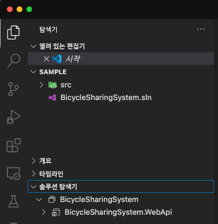

# 02. Backend with .NET Aspire!

## 세션 목표

* ASP.NET Core로 Backend API 서버를 만들어봅니다.
* Docker에 MySQL 컨테이너를 생성해봅니다.
* 개발을 간단하게 만들어주는 .NET Aspire에 대해 알아봅니다.


## 세션 준비

1. 오늘 이 시간에는 Visual Studio Code를 이용합니다.
1. [Prerequisites](../0.%20prerequisites/readme.md)에 나온 확장 도구와 Docker를 설치합니다.
    * [C# Dev Kit](https://marketplace.visualstudio.com/items?itemName=ms-dotnettools.csdevkit)
    * [REST Client](https://marketplace.visualstudio.com/items?itemName=humao.rest-client)
    * [Docker Desktop](https://www.docker.com/products/docker-desktop/)
1. 오늘 실습할 디렉토리는 [start](./start) 입니다.

> 📍 만약 이 단계를 마무리하지 못했더라도 괜찮아요!
> 저희가 실습을 따라할 수 있도록 공개 API 서버를 워크샵 기간동안 운영하고 있습니다!
> https://ame.ac


---


## 차례

1. [Backend API Server 만들기](#backend-api-server-만들기)
1. [대여소와 자전거 모델 만들기](#대여소와-자전거-모델-만들기)
1. [대여소와 자전거의 CRUD Controller 만들기](#대여소와-자전거의-crud-controller-만들기)
1. [MySQL 컨테이너 생성하고 연결하기](#mysql-컨테이너-생성하고-연결하기)
1. [.NET Aspire 시작하기](#net-aspire-시작하기)


---


## Backend API Server 만들기

1. 아래 명령어를 입력하여 `BicycleSharingSystem.WebApi`라는 이름으로 `src` 폴더에 새 프로젝트를 생성합니다.

    ```sh
    dotnet new webapi -n "BicycleSharingSystem.WebApi" -o src
    ```

1. 그리고 솔루션 파일을 만들고 방금 만든 프로젝트를 추가합니다.
    ```sh
    dotnet new sln -n "BicycleSharingSystem"
    dotnet sln add ./src/BicycleSharingSystem.WebApi.csproj
    ```
1. 이제 Visual Studio Code를 열고 "폴더 열기" 기능을 이용해 start 폴더를 엽니다.

1. 열린 편집기에서 아래 그림과 같이 "솔루션 탐색기"가 보이는지 확인합니다.
    * 만약 보이지 않는다면 `C# Dev Kit` 확장이 올바르게 설치가 되지 않았을 수 있습니다. 재설치를 시도해봅니다.

    

1. 우리는 컨트롤러 기반의 API를 만들 것이기 때문에 `Program.cs` 파일의 `builder` 아래에 다음 줄을 추가합니다.

    ```cs
    builder.Services.AddControllers();
    ```

1. 이어서 다음 코드도 제거합니다.

    ```cs
    var summaries = new[]
    {
        "Freezing", "Bracing", "Chilly", "Cool", "Mild", "Warm", "Balmy", "Hot", "Sweltering", "Scorching"
    };

    app.MapGet("/weatherforecast", () =>
    {
        var forecast =  Enumerable.Range(1, 5).Select(index =>
            new WeatherForecast
            (
                DateOnly.FromDateTime(DateTime.Now.AddDays(index)),
                Random.Shared.Next(-20, 55),
                summaries[Random.Shared.Next(summaries.Length)]
            ))
            .ToArray();
        return forecast;
    })
    .WithName("GetWeatherForecast")
    .WithOpenApi();
    ```

    ```cs
    record WeatherForecast(DateOnly Date, int TemperatureC, string? Summary)
    {
        public int TemperatureF => 32 + (int)(TemperatureC / 0.5556);
    }
    ```

1. 이어서 컨트롤러를 사용한다는 내용을 `app.run()` 위에 추가합니다.

    ```cs
    app.MapControllers();
    ```

1. 그러면 `Program.cs` 파일은 아래처럼 구성됩니다.

    ```cs
    var builder = WebApplication.CreateBuilder(args);

    builder.Services.AddControllers();
    builder.Services.AddEndpointsApiExplorer();
    builder.Services.AddSwaggerGen();

    var app = builder.Build();

    if (app.Environment.IsDevelopment())
    {
        app.UseSwagger();
        app.UseSwaggerUI();
    }

    app.UseHttpsRedirection();
    app.MapControllers();
    app.Run();
    ```

1. 다음 명령어를 사용하여 백엔드 앱이 정상 동작하는지 확인합니다.
    * 지금은 만든 API가 없기 때문에 빈 화면만 나타납니다.

    ```sh
    dotnet restore && dotnet watch
    ```

    


---


## 대여소와 자전거 모델 만들기

1. `Models`라는 이름의 새 폴더를 만듭니다.

1. 이어서 `BicycleModel.cs` 파일을 생성하고 아래 내용을 추가합니다.
    * `BicycleId` - 자전거의 ID입니다. 수동으로 지정하거나 자동으로 생성하도록 하지만 처음 한번만 설정할 수 있습니다.
    * `RentalOfficeId` - 대여소의 ID입니다.
    * `Name` - 해당 자전거의 이름입니다.
    * `StartRentalTime` - 대여 시작 시간입니다.
    * `ExpireRentalTime` - 대여 반납 시간입니다.
    * `IsRental` - 대여 중 여부입니다. 대여 시작 시간이 있으면 대여 중으로 인식합니다.

    ```cs
    public sealed class BicycleModel
    {
        [Key]
        public Guid BicycleId { get; init; } = Guid.NewGuid();

        [Required]
        public required Guid RentalOfficeId { get; set; }

        [Required]
        [MaxLength(100)]
        public required string Name { get; set; } = null!;

        public DateTime? StartRentalTime { get; set; }

        public DateTime? ExpireRentalTime { get; set; }

        public bool IsRental => StartRentalTime.HasValue;
    }
    ```

1. 이어서 `RentalOfficeModel.cs` 파일을 만들고 아래 내용을 추가합니다.
    * `OfficeId` - 대여소의 ID입니다. 수동으로 지정하거나 자동으로 생성하도록 하지만 처음 한번만 설정할 수 있습니다.
    * `Name` - 대여소의 이름입니다.
    * `Region` - 대여소의 지역입니다.
    * `Latitude` - 대여소가 있는 지역의 위도입니다.
    * `Longitude` - 대여소가 있는 지역의 경도입니다.

    ```cs
    public sealed class RentalOfficeModel
    {
        [Key]
        public Guid OfficeId { get; init; } = Guid.NewGuid();

        [Required]
        [MaxLength(100)]
        public required string Name { get; init; } = null!;

        [Required]
        [MaxLength(100)]
        public required string Region { get; init; } = null!;

        public double? Latitude { get; init; }

        public double? Longitude { get; init; }
    }
    ```


---


## 대여소와 자전거의 CRUD Controller 만들기

1. `Controllers`라는 이름의 새 폴더를 만듭니다.

1. 이어서 `BicycleController.cs` 파일을 생성하고 아래 내용을 추가합니다.

    ```cs
    [ApiController]
    [Route("[controller]")]
    public sealed class BicycleController : ControllerBase
    {
        [HttpGet("{id:guid}")]
        public BicycleModel? Get(Guid id) => default;

        [HttpPost]
        public async Task<IActionResult> Post(IEnumerable<BicycleModel> bicycles) => Ok();

        [HttpPut("{id:guid}")]
        public async Task<IActionResult> Put(Guid id, BicycleModel bicycle) => Ok();

        [HttpDelete("{id:guid}")]
        public async Task<IActionResult> Delete(Guid id) => Ok();
    }
    ```

1. 이어서 `RentalOfficeController.cs` 파일을 생성하고 아래 내용을 추가합니다.

    ```cs
    [ApiController]
    [Route("[controller]")]
    public sealed class RentalOfficeController : ControllerBase
    {
        [HttpGet]
        public IEnumerable<RentalOfficeModel> GetAll() => Enumerable.Empty<RentalOfficeModel>();

        [HttpGet("{name}")]
        public object? Get(string name) => default;

        [HttpPost]
        public async Task<IActionResult> Post(IEnumerable<RentalOfficeModel> rentalOffices) => Ok();

        [HttpPut("{name}")]
        public async Task<IActionResult> Put(string name, RentalOfficeModel updateRentalOffice) => Ok();

        [HttpDelete("{name}")]
        public async Task<IActionResult> Delete(string name) => Ok();
    }
    ```

1. 그리고 다시 빌드하여 컨트롤러와 API가 생겼는지 확인합니다.

    ```sh
    dotnet watch
    ```

    


---


## MySQL 컨테이너 생성하고 연결하기


---


## .NET Aspire 시작하기

