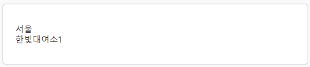

# 목차

1. 컴포넌트 만들기
2. 정렬 컨트롤 만들기
3. 화면 조합하기
4. 화면 전환하기
5. API 연동

# 프로젝트 생성하기
```
BicycleSharingSystem.Kiosk
```


# 컴포넌트 만들기

## TopBanner


1. Components 폴더에 `Avalonia Template Control` 생성 TopBanner
2. PreviewWith 설정하기
```xml
<Design.PreviewWith>
    <Grid
        Background="#F9F9F9"
        RowDefinitions="27, *, 90, 38"
        Width="540">
        <controls:TopBanner />
    </Grid>
</Design.PreviewWith>
```
3. 아이콘 사용을 위해 접두어를 추가합니다.
```xml
xmlns:i="https://github.com/projektanker/icons.avalonia"
```
4. 화면 태그들을 삽입합니다.
```xml
<Setter Property="Template">
    <ControlTemplate>
        <Grid Background="White" ColumnDefinitions="95,*">
            <Border Grid.Column="1" Padding="10,0">
                <TextBlock Text="BMW와 함께 하는 안전한 라이딩" />
            </Border>
            <Label
                Background="{StaticResource ColorBlack}"
                Grid.Column="0"
                HorizontalContentAlignment="Center">
                <Label.Content>
                    <StackPanel Orientation="Horizontal" Spacing="2">
                        <i:Icon
                            FontSize="18"
                            Foreground="{StaticResource ColorWhite}"
                            Value="mdi-microphone" />
                        <TextBlock Foreground="{StaticResource ColorWhite}" Text="공지사항" />
                    </StackPanel>
                </Label.Content>
            </Label>
        </Grid>
    </ControlTemplate>
</Setter>
```
5. `TextBlock`의 기본 스타일과 `TextBlock`의 슬라이딩 Style를 추가합니다.
```xml
<Grid.Styles>
    <Style Selector="TextBlock">
        <Setter Property="VerticalAlignment" Value="Center" />
        <Setter Property="FontSize" Value="15" />
    </Style>
    <Style Selector="TextBlock.Message">
        <Style.Animations>
            <Animation
                Delay="0:0:1"
                Duration="0:0:15"
                IterationCount="INFINITE">
                <KeyFrame Cue="0%">
                    <Setter Property="TranslateTransform.X" Value="540" />
                </KeyFrame>
                <KeyFrame Cue="100%">
                    <Setter Property="TranslateTransform.X" Value="-540" />
                </KeyFrame>
            </Animation>
        </Style.Animations>
    </Style>
</Grid.Styles>
```
6. Classes를 통한 Style 적용하기
```xml
<TextBlock Classes="Message" Text="BMW와 함께 하는 안전한 라이딩" />
```

## NavigationBar


1. Components 폴더에 `Avalonia Template Control` 생성 NavigationBar
2. PreviewWith 설정하기
```xml
<Design.PreviewWith>
    <Grid
        Background="#F9F9F9"
        RowDefinitions="27, *, 90, 38"
        Width="540">
        <controls:NavigationBar Grid.Row="2" />
    </Grid>
</Design.PreviewWith>
```
3. 아이콘 사용을 위해 접두어를 추가합니다.
```xml
xmlns:i="https://github.com/projektanker/icons.avalonia"
```
4. 화면 태그들을 삽입합니다.
```xml
<Setter Property="Template">
    <ControlTemplate>
        <Border
            Background="White"
            BorderBrush="DarkGray"
            BorderThickness="1"
            CornerRadius="10 10 0 0"
            Margin="0.6,0"
            Padding="5">
            <UniformGrid Columns="4">
                <Button
                    Content="처음화면"
                    Tag="mdi-home" />
                <Button
                    Content="대여소"
                    Tag="mdi-bike" />
                <Button
                    Content="서비스 준비중"
                    Tag="mdi-wrench" />
                <Button
                    Content="서비스 준비중"
                    Tag="mdi-wrench" />
            </UniformGrid>
        </Border>
    </ControlTemplate>
</Setter>
```
5. Button Theme 만들기  (Style로도 가능하지만 다른방법 있다라는 걸 알려주기 위해서)
```xml
<!-- ResourceDicionary로 생성 된 경우-->
<ControlTheme x:Key="NaviItem" TargetType="Button">
    <Setter Property="Background" Value="Transparent" />
    <Setter Property="Template">
        <ControlTemplate>
            <Border
                    Width="90"
                    Background="{TemplateBinding Background}"
                    CornerRadius="5">
                <StackPanel VerticalAlignment="Center" Orientation="Vertical">
                    <i:Icon FontSize="40" Value="{TemplateBinding Tag}" />
                    <TextBlock
                            HorizontalAlignment="Center"
                            FontWeight="Bold"
                            Foreground="{StaticResource ColorBlack}"
                            Text="{TemplateBinding Content}" />
                </StackPanel>
            </Border>
        </ControlTemplate>
    </Setter>
</ControlTheme>
--------------------------------------------------------------------------------------
<!-- Styles 로 생성된 경우-->
<Styles.Resources>
    <ControlTheme TargetType="Button" x:Key="NaviItem">
        <Setter Property="Background" Value="Transparent" />
        <Setter Property="Template">
            <ControlTemplate>
                <Border
                    Background="{TemplateBinding Background}"
                    CornerRadius="5"
                    Width="90">
                    <StackPanel Orientation="Vertical" VerticalAlignment="Center">
                        <i:Icon FontSize="40" Value="{TemplateBinding Tag}" />
                        <TextBlock
                            FontWeight="Bold"
                            Foreground="{StaticResource ColorBlack}"
                            HorizontalAlignment="Center"
                            Text="{TemplateBinding Content}" />
                    </StackPanel>
                </Border>
            </ControlTemplate>
        </Setter>
    </ControlTheme>
</Styles.Resources>
```
6. 테마 적용해보기
```xml
Theme="{StaticResource NaviItem}" 
```
```xml
<Button
    Content="처음화면"
    Tag="mdi-home"
    Theme="{StaticResource NaviItem}" />
<Button
    Content="대여소"
    Tag="mdi-bike"
    Theme="{StaticResource NaviItem}" />
<Button
    Content="서비스 준비중"
    Tag="mdi-wrench"
    Theme="{StaticResource NaviItem}" />
<Button
    Content="서비스 준비중"
    Tag="mdi-wrench"
    Theme="{StaticResource NaviItem}" />
```
7. Command Binding 적용해놓기
```xml
Command="{Binding HomeButtonCommand}"
.
.
Command="{Binding RentalOfficeButtonCommand}"
```
```xml
 <Button
    Command="{Binding HomeButtonCommand}"
    Content="처음화면"
    Tag="mdi-home"
    Theme="{StaticResource NaviItem}" />
<Button
    Command="{Binding RentalOfficeButtonCommand}"
    Content="대여소"
    Tag="mdi-bike"
    Theme="{StaticResource NaviItem}" />
```
8. 마우스 올렸을 때 색상 변하게 하기
```xml
<Style Selector="^ /template/ Button:pointerover">
    <Setter Property="Background" Value="#e6e6e6" />
</Style>
```

## BottomBanner


1. Components 폴더에 `Avalonia Template Control` 생성 BottomBanner
2. PreviewWith 설정하기
```xml
<Design.PreviewWith>
    <Grid
        Background="#F9F9F9"
        RowDefinitions="27, *, 90, 38"
        Width="540">
        <controls:BottomBanner Grid.Row="3" />
    </Grid>
</Design.PreviewWith>
```
3. xaml에서 현재 시간을 임의로 저장하기 위해 sys 접두어를 추가해줍니다.
```xml
xmlns:sys="clr-namespace:System;assembly=System.Runtime"
```
```xml
<Setter Property="Template">
    <ControlTemplate>
        <Border
            Background="{StaticResource ColorBlack}"
            Grid.Row="2"
            Padding="10,0">
            <TextBlock
                Foreground="{StaticResource ColorWhite}"
                Text="{Binding Source={x:Static sys:DateTime.Now}, StringFormat='{}{0:yyyy.MM.dd HH:mm}', Mode=OneWay}"
                VerticalAlignment="Center" />
        </Border>
    </ControlTemplate>
</Setter>
``` 

## 대여소 컨트롤


1. Pages/RentalOffice//Components 폴더에 `Avalonia Template Control` 생성 RentalOfficeItem
2. PreviewWith 설정하기
```xml
<Design.PreviewWith>
    <Border Background="#F9F9F9" Padding="30">
        <controls:RentalOfficeItem />
    </Border>
</Design.PreviewWith>
```
3. 화면 태그들을 삽입합니다.
```xml
 <Setter Property="Template">
    <ControlTemplate>
        <Border
            Background="White"
            BorderBrush="#d2d2d2"
            BorderThickness="1"
            CornerRadius="5"
            Height="100"
            Padding="20"
            Width="500">
            <TextBlock VerticalAlignment="Center" Foreground="{StaticResource ColorBlack}">
                <Run Text="{Binding RegionName}" />
                <LineBreak />
                <Run Text="{Binding Name}" />
            </TextBlock>
        </Border>
    </ControlTemplate>
</Setter>
```
4. Click 시 Button Command 를 발생시키기 위해 다음과 같이 수정합니다.
```csharp
// RentalOfficeItem.xaml.cs
public static readonly AvaloniaProperty CommandProperty =
        AvaloniaProperty.Register<RentalOfficeItem, ICommand?>(nameof(Command));

public ICommand? Command
{
    get => (ICommand?)GetValue(CommandProperty);
    set => SetValue(CommandProperty, value);
}

    public RentalOfficeItem()
    {
    this.Tapped += (s, e) =>
        {
        this.Command?.Execute(this.DataContext);
        };
    }
}
```
5. Command와 ViewModel의 커맨드를 미리 설정 해놓습니다.
```xml
<!-- <Setter Property="Command" Value="{Binding Path=DataContext.SelectedRentalOfficeCommand, RelativeSource={RelativeSource AncestorType={x:Type controls:RentalOfficePanel}}}" />-->
```

## 자전거 컨트롤
 

1. Pages/Bicycle/Components 폴더에 `Avalonia Template Control` 생성 BicycleItem
2. PreviewWith 설정하기
```xml
<Design.PreviewWith>
    <Border Background="White" Padding="100">
        <controls:BicycleItem />
    </Border>
</Design.PreviewWith>
```

3. 화면 태그들을 삽입합니다.
```xml
 <Setter Property="Template">
    <ControlTemplate>
        <Border Background="Transparent" Padding="50">
            <StackPanel HorizontalAlignment="Center" Orientation="Vertical">
                <Viewbox Height="100" Width="100">
                    <Viewbox.Styles>
                        <Style Selector="Path.isRental">
                            <Setter Property="Fill" Value="{StaticResource ColorRed}" />
                        </Style>
                        <Style Selector="Path.isNotRental">
                            <Setter Property="Fill" Value="{StaticResource ColorBlack}" />
                        </Style>
                    </Viewbox.Styles>
                    <Path
                        Classes.isNotRental="{Binding !IsRental}"
                        Classes.isRental="{Binding IsRental}"
                        Data="M19 10C18.44 10 17.91 10.11 17.41 10.28L14.46 4.5H11V6H13.54L14.42 7.72L12 13.13L10.23 8.95C10.5 8.85 10.74 8.58 10.74 8.25C10.74 7.84 10.41 7.5 10 7.5H8C7.58 7.5 7.24 7.84 7.24 8.25S7.58 9 8 9H8.61L10.86 14.25H9.92C9.56 11.85 7.5 10 5 10C2.24 10 0 12.24 0 15S2.24 20 5 20C7.5 20 9.56 18.15 9.92 15.75H12.5L15.29 9.43L16.08 10.96C14.82 11.87 14 13.34 14 15C14 17.76 16.24 20 19 20S24 17.76 24 15 21.76 10 19 10M5 18.5C3.07 18.5 1.5 16.93 1.5 15S3.07 11.5 5 11.5C6.67 11.5 8.07 12.68 8.41 14.25H4V15.75H8.41C8.07 17.32 6.67 18.5 5 18.5M19 18.5C17.07 18.5 15.5 16.93 15.5 15C15.5 13.92 16 12.97 16.77 12.33L18.57 15.85L19.89 15.13L18.1 11.63C18.39 11.56 18.69 11.5 19 11.5C20.93 11.5 22.5 13.07 22.5 15S20.93 18.5 19 18.5Z"
                        x:Name="PART_BIKE" />
                </Viewbox>
                <TextBlock
                    HorizontalAlignment="Center"
                    Text="{Binding Name}"
                    VerticalAlignment="Center" />
                <TextBlock IsVisible="{Binding IsRental}" Foreground="{StaticResource ColorBlack}">
                    <Run Text="대여시작시간 : " />
                    <Run Text="{Binding StartRentalTime}" />
                    <LineBreak />
                    <Run Text="반납예정시간 : " />
                    <Run Text="{Binding RemainDateTime}" />
                </TextBlock>
            </StackPanel>
        </Border>
    </ControlTemplate>
</Setter>
```
<Br/><Br/><Br/>

# 정렬 컨트롤 만들기
<Br/>

## RentOfficeItem의 Panel 만들기
 - 단순하게 ListBox를 통해 만들 수도 있지만 Item 선택 시 SelecteItem이 아닌 Command형태로 받기 위해 커스텀처리
  
1. Pages/RentalOffice/Components 폴더에 `Avalonia Template Control` 생성 RentalOfficePanel
2. 화면 태그들을 삽입합니다.
```xml
<Setter Property="ItemsPanel">
    <ItemsPanelTemplate>
        <StackPanel Orientation="Vertical" Spacing="10" />
    </ItemsPanelTemplate>
</Setter>
<!--  Set Defaults  -->
<Setter Property="Template">
    <ControlTemplate>
        <ItemsPresenter ItemsPanel="{TemplateBinding ItemsPanel}" />
    </ControlTemplate>
</Setter>
```
3. RentalOfficeItem 컨트롤 형태로 자식 요소로 그리기 위해서 다음과 같이 처리해줍니다.
```csharp
public class RentalOfficePanel : ListBox
{
    protected override Control CreateContainerForItemOverride(object? item, int index, object? recycleKey)
    {
        return new RentalOfficeItem();
    }
}
```

4. Resourece 추가 후 PreviewWith 설정을합니다.
```xml
<ResourceDictionary.MergedDictionaries>
    <!-- Rider의 경우-->
    <ResourceInclude Source="RentalOfficeItem.axaml" />
    <!--VisualStudio의 경우 -->
    <ResourceInclude Source="avares://BicycleSharingSystem.Kiosk/Pages/RentalOffice/Components/RentalOfficeItem.axaml" />
</ResourceDictionary.MergedDictionaries>
<Design.PreviewWith>
    <controls:RentalOfficePanel>
        <controls:RentalOfficeItem />
        <controls:RentalOfficeItem />
        <controls:RentalOfficeItem />
    </controls:RentalOfficePanel>
</Design.PreviewWith>

5. RentalOfficeItem.axaml에 주석해놓은 것을 해제합니다.
```

## BicycleItem의 Panel 만들기
1. Pages/Bicycle/Components 폴더에 `Avalonia Template Control` 생성 BicyclePanel
2. 화면 태그들을 삽입합니다.
```xml
<Setter Property="ItemsPanel">
    <ItemsPanelTemplate>
        <UniformGrid Columns="2" />
    </ItemsPanelTemplate>
</Setter>
<!--  Set Defaults  -->
<Setter Property="Template">
    <ControlTemplate>
        <ItemsPresenter ItemsPanel="{TemplateBinding ItemsPanel}" />
    </ControlTemplate>
</Setter>
```
3. BicycleItem 컨트롤 형태로 자식 요소로 그리기 위해서 다음과 같이 처리해줍니다.
```csharp
public class BicyclePanel : ListBox
{
    protected override Control CreateContainerForItemOverride(object? item, int index, object? recycleKey)
    {
        return new BicycleItem();
    }
}
```
4. Styles 추가 후 PreviewWith 설정을합니다.
```xml
<StyleInclude Source="BicycleItem.axaml" />
<ResourceDictionary.MergedDictionaries>
    <!-- Rider의 경우-->
    <ResourceInclude Source="BicycleItem.axaml" />
    <!--VisualStudio의 경우 -->
    <ResourceInclude Source="avares://BicycleSharingSystem.Kiosk/Pages/Bicycle/Components/BicycleItem.axaml" />
</ResourceDictionary.MergedDictionaries>
<Design.PreviewWith>
    <Grid Height="1000" Width="580">
        <controls:BicyclePanel HorizontalAlignment="Center">
            <controls:BicycleItem Margin="10" />
            <controls:BicycleItem Margin="10" />
            <controls:BicycleItem />
        </controls:BicyclePanel>
    </Grid>
</Design.PreviewWith>
```
<br/>
<br/>
<br/>

# 화면 조합하기
## 자전거 화면 조합하기
1. Pages/Bicycle/Index.xaml을 엽니다.
2. Styles 또는 ResourceDictionary를 추가해줍니다.
```xml
<!--ResourceDictionary로 만들어진 경우-->
 <UserControl.Resources>
    <ResourceDictionary>
        <ResourceDictionary.MergedDictionaries>
        </ResourceDictionary.MergedDictionaries>
    </ResourceDictionary>
</UserControl.Resources>


<!--Styles로 만들어진 경우-->
<UserControl.Styles>
</UserControl.Styles>
```

3. 화면 요소들을 삽입합니다.
```xml
.
.
.
<Border Padding="10,50">
    <Grid RowDefinitions="Auto,50,*">
        <TextBlock Text="{Binding RenterShopName}" />
        <ScrollViewer Grid.Row="2">
            <StackPanel>
                <component:BicyclePanel ItemsSource="{Binding Bicycles}" />
            </StackPanel>
        </ScrollViewer>
    </Grid>
</Border>
```
## 대여소 화면 조합하기
1. Pages/RentalOffice/Index.xaml을 엽니다.
2. Styles 또는 ResourceDictionary를 추가해줍니다.
```xml
<!--ResourceDictionary로 만들어진 경우-->
 <UserControl.Resources>
    <ResourceDictionary>
        <ResourceDictionary.MergedDictionaries>
        </ResourceDictionary.MergedDictionaries>
    </ResourceDictionary>
</UserControl.Resources>


<!--Styles로 만들어진 경우-->
<UserControl.Styles>
</UserControl.Styles>
```
3. 화면 요소들을 삽입합니다.
```xml
.
.
.
 <Border Padding="10,10">
    <StackPanel Orientation="Vertical" Spacing="10">
        <ComboBox ItemsSource="{Binding Regions}" SelectedItem="{Binding SelectedRegions}" />
        <component:RentalOfficePanel ItemsSource="{Binding FilterRentalOffices}" />
    </StackPanel>
</Border>
```
## 홈화면 만들기
1. Pages\Home\Index.axaml를엽니다.
2. 다음 요소를 삽입합니다.
```xml
    <Image Source="avares://BicycleSharingSystem.Kiosk/Assets/BMW Logo.png"  Height="312" Width="312" ></Image>
```
## 윈도우 화면 조합하기
1. MainWindow.xaml를 엽니다.
2. 윈도우의 사이즈를 설정해줍니다.
```xml
Height="960"
MaxHeight="960"
MaxWidth="540"
MinHeight="960"
MinWidth="540"
Width="540"
d:DesignHeight="960"
d:DesignWidth="540"
```
3. Styles 또는 ResourceDictionary 추가하기
```xml
xmlns:components="clr-namespace:BicycleSharingSystem.Kiosk.Components"
    
 .
 .
 .
    <!--ResourceDictionary로 만들어진 경우-->
    <Window.Resources>
        <ResourceDictionary>
            <ResourceDictionary.MergedDictionaries>
            </ResourceDictionary.MergedDictionaries>
        </ResourceDictionary>
    </Window.Resources>
--------------------------------------------------------------------------------------
   <!--Styles로 만들어진 경우-->
   <Window.Styles>
   </Window.Styles>
```

4. 화면 요소 추가
```xml
<Grid RowDefinitions="27, *, 90, 38">
    <components:TopBanner />       
    <ContentControl Content="{Binding CurrentPage}" Grid.Row="1"/>
    <components:NavigationBar Grid.Row="2" />
    <components:BottomBanner Grid.Row="3" />
</Grid>
```
5. Queries 폴더 생성 후 `IBicycleQuery`, `IRentalOfficeQuery` 인터페이스 생성 및 아래 코드 복붙
```csharp
// /Queries/IBicycleQuery.cs
namespace BicycleSharingSystem.Kiosk.Queries;
// DTO 모델
public sealed class BicycleDTO
{
    public string BicycleId { get; set; }
    public string RentalOfficeId { get; set; }
    public DateTime? StartRentalTime { get; set; }
    public string Name { get; set; }
    public DateTime? ExpireRentalTime { get; set; }
    public bool IsRental => StartRentalTime.HasValue;
}

public interface IBicycleQuery
{
    Task<List<BicycleDTO>> Get(string RentalOfficeId);
}

// 실제 연결 데이터 
public class BicycleQuery: IBicycleQuery
{
    public async Task<List<BicycleDTO>> Get(string RentalOfficeId)
    {
        throw new NotImplementedException();
    }
}

// 테스트 데이터 쿼리
public class TestBicycleQuery :IBicycleQuery
{
    public async Task<List<BicycleDTO>> Get(string RentalOfficeId)
    {
        return new List<BicycleDTO>()
        {
            new BicycleDTO()
            {
                BicycleId = Guid.NewGuid().ToString(),
                RentalOfficeId = RentalOfficeId,
                Name="Bike 1호기"
            },
            new BicycleDTO()
            {
                BicycleId = Guid.NewGuid().ToString(),
                RentalOfficeId = RentalOfficeId,
                Name="Bike 2호기"
            },
            new BicycleDTO()
            {
                BicycleId = Guid.NewGuid().ToString(),
                RentalOfficeId = RentalOfficeId,
                Name="Bike 3호기",
                StartRentalTime = DateTime.Now,
                ExpireRentalTime = DateTime.Now.AddMinutes(5)
            },
        };
    }
}    
```
```csharp
// /Queries/IRentalOfficeQuery.cs
namespace BicycleSharingSystem.Kiosk.Queries;

// DTO 모델
public class RentalOfficeDTO
{
    public string OfficeId { get; set; }
    public string Name { get; set; }
    public string Region { get; set; } 
}

public interface IRentalOfficeQuery
{
    Task<List<RentalOfficeDTO>> Get();
}

// 실제 연결 데이터 
public class RentalOfficeQuery : IRentalOfficeQuery
{
    public async Task<List<RentalOfficeDTO>> Get()
    {
        throw new NotImplementedException();
    }
}
// 테스트 데이터 
public class TestRentalOfficeQuery : IRentalOfficeQuery
{
    public async Task<List<RentalOfficeDTO>> Get()
    {
        return new List<RentalOfficeDTO>
        {
            new RentalOfficeDTO() {OfficeId = Guid.NewGuid().ToString(), Name = "한빛대여소1", Region = "서울"},
            new RentalOfficeDTO() {OfficeId = Guid.NewGuid().ToString(), Name = "한빛대여소2", Region = "서울"},
            new RentalOfficeDTO() {OfficeId = Guid.NewGuid().ToString(), Name = "한빛대여소3", Region = "서울"},
            new RentalOfficeDTO() {OfficeId = Guid.NewGuid().ToString(), Name = "BMW대여소1", Region = "경기"},
            new RentalOfficeDTO() {OfficeId = Guid.NewGuid().ToString(), Name = "BMW대여소2", Region = "경기"},
        };
    }
}
```
```csharp
// Pages/Bicycle/Models/BicycleModel.cs
using BicycleSharingSystem.Kiosk.Queries;

using CommunityToolkit.Mvvm.ComponentModel;

namespace BicycleSharingSystem.Kiosk.Pages.Bicycle.Models;

public partial class BicycleModel : ObservableObject
{
    public string Name { get; set; }
    public string StartRentalTime { get; set; }
    public string RemainDateTime { get; set; }
    [ObservableProperty] private bool isRental = false;

    public BicycleModel(BicycleDTO dto)
    {
        this.Name = dto.Name;
        this.IsRental = dto.IsRental;
        if (this.IsRental)
        {
            this.StartRentalTime = dto.StartRentalTime.Value.ToString("HH:mm");
            TimeSpan timeDiff = dto.ExpireRentalTime.Value - DateTime.Now;
            this.RemainDateTime = $"{timeDiff.Minutes.ToString("D2")}:{timeDiff.Seconds.ToString("D2")}";
        }
    }
}
```
```csharp
// Pages/RentalOffice/Models/RentalOfficeModel.cs
using BicycleSharingSystem.Kiosk.Queries;

namespace BicycleSharingSystem.Kiosk.Pages.RentalOffice.Models;

public class RentalOfficeModel
{
    public string Number { get; set; }
    public string RegionName { get; set; }
    public string Name { get; set; }

    public RentalOfficeModel(RentalOfficeDTO dto)
    {
        Number = dto.OfficeId;
        Name = dto.Name;
        RegionName = dto.Region;
    }
}
```
```csharp
// ViewMoelBase.cs
public class ViewModelBase : ObservableObject
{
    public virtual async Task Load()
    {
        
    }
}
```
```csharp
// MainWindowViewModel.cs
public partial class MainWindowViewModel : ViewModelBase
{
    [ObservableProperty]
    private ViewModelBase _currentPage;

    private ViewModelBase[] Pages;
    public MainWindowViewModel(IRentalOfficeQuery rentalOfficeQuery,
                               IBicycleQuery bicycleQuery)
    {
        Pages = new ViewModelBase[]{
            new HomeViewModel(),
            new RentalOfficeViewModel(rentalOfficeQuery),
            new BicycleViewModel(bicycleQuery),
        };
        this.CurrentPage = Pages[0];
        
        WeakReferenceMessenger.Default.Register<SelectRentalOfficeChangeMessage>(this, (r, m) =>
        {
            var model = m.Value;

            this.CurrentPage = Pages[2];
            
            ((BicycleViewModel)this.CurrentPage).Init((model));
        });
    }

    [RelayCommand]
    private void HomeButton()
    {
        this.CurrentPage = Pages[0];
    }
    [RelayCommand]
    private void RentalOfficeButton()
    {
        this.CurrentPage = Pages[1];
    }
}
```
```csharp
// BicycleViewModels.cs
public partial class BicycleViewModel : ViewModelBase
{
    [ObservableProperty] private List<BicycleModel> bicycles;
    [ObservableProperty] private string renterShopName;
    private readonly IBicycleQuery _bicycleQuery;
    public BicycleViewModel(IBicycleQuery bicycleQuery)
    {
        this._bicycleQuery = bicycleQuery;
        this.Bicycles = new();
    }
    public async Task  Init(RentalOfficeModel model)
    {
        this.RenterShopName = model.Name;
        this.Bicycles.Clear();
        foreach (var item in await this._bicycleQuery.Get(model.Number))
        {
            this.Bicycles.Add(new BicycleModel(item));
        }
    }
}
```
```csharp
// RentalOfficeViewModel.cs
public partial class RentalOfficeViewModel: ViewModelBase
{
    [ObservableProperty] ObservableCollection<RentalOfficeModel> rentalOffices;
    [ObservableProperty] ObservableCollection<RentalOfficeModel> filterRentalOffices;
    [ObservableProperty] ObservableCollection<string> regions;
    [ObservableProperty] string selectedRegions;
    private readonly IRentalOfficeQuery _rentalOfficeQuery;
    public RentalOfficeViewModel(IRentalOfficeQuery rentalOfficeQuery)
    {
        _rentalOfficeQuery = rentalOfficeQuery;
        this.RentalOffices = new();
        this.Regions = new();
        this.FilterRentalOffices = new();
    }

    protected override void OnPropertyChanged(PropertyChangedEventArgs e)
    {
        base.OnPropertyChanged(e);

        if (e.PropertyName == "SelectedRegions")
        {
            if (SelectedRegions == "전체")
            {
                this.FilterRentalOffices = RentalOffices;
            }
            else
            {
                this.FilterRentalOffices = new (RentalOffices.Where(x=>x.RegionName == SelectedRegions).ToList());
            }
        }
    }

    public override async Task Load()
    {
        RentalOffices.Clear();
        Regions.Clear();
        foreach (var item in await this._rentalOfficeQuery.Get())
        {
            RentalOffices.Add(new RentalOfficeModel(item));
        }
        
        Regions = new(RentalOffices
            .GroupBy(p => p.RegionName)
            .Select(g => g.Key).ToList());
        
        Regions.Insert(0, "전체");

        SelectedRegions = Regions.First();
    }

    [RelayCommand]
    private void SelectedRentalOffice(RentalOfficeModel model)
    {
        WeakReferenceMessenger.Default.Send(new SelectRentalOfficeChangeMessage(model));
    }
}
```
```csharp
// App.axaml.cs
public override void OnFrameworkInitializationCompleted()
{
    if (ApplicationLifetime is IClassicDesktopStyleApplicationLifetime desktop)
    {
        // Line below is needed to remove Avalonia data validation.
        // Without this line you will get duplicate validations from both Avalonia and CT
        BindingPlugins.DataValidators.RemoveAt(0);
        desktop.MainWindow = new MainWindow
        {
            DataContext = new MainWindowViewModel(new TestRentalOfficeQuery(), new TestBicycleQuery()),
        };
    }

    base.OnFrameworkInitializationCompleted();
}
```
```xml
<TransitioningContentControl Content="{Binding CurrentPage}" Grid.Row="1">
    <TransitioningContentControl.PageTransition>
        <PageSlide Duration="0:00:00.500" Orientation="Vertical" />
    </TransitioningContentControl.PageTransition>
</TransitioningContentControl>
```


TODO : 
