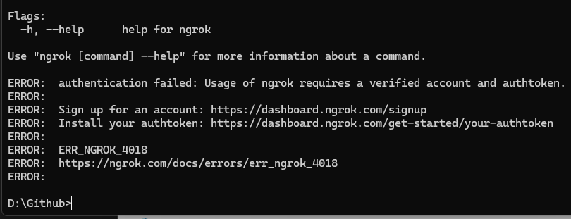
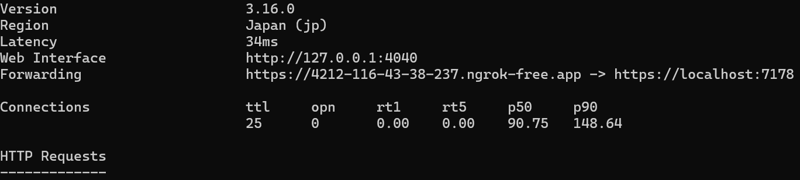

# 목차

1. WEB API 연결
2. 관련 패키지 설치 및 구성
3. 프로젝트 구성 확인
5. 개별 화면 구현
6. 동작 확인


### Step 1: WEB API 연결
- 자전거 대여 및 반납 기능에 필요한 API를 연결합니다.
- 각 기능에 맞는 API 엔드포인트를 설정하고, 데이터 통신을 위한 서비스를 구성합니다.

#### 주요 작업:
- `APIService.cs` 파일에서 API 호출 로직 확인
- `Models` 폴더에서 API 통신과 주고 받을 모델 파일 확인
- 대여, 반납에 필요한 API 엔드포인트를 확인 및 설정

#### 설명:
 - 이미 제공 받은 외부 API 주소가 아닌 localhost를 에뮬레이터와 연결하는 방법은 dev tunnel과 ngrok 서비스 등을 이용하여 연결 할 수 있으며 이번 데모에서는 `ngrok`을 사용하여 작업 진행
 - https://ngrok.com/download 해당 페이지에서 다운로드
 - [ngrok](https://dashboard.ngrok.com/) 사이트 회원가입
 - https://dashboard.ngrok.com/get-started/your-authtoken 토큰 발급
 - 아래와 같이 `ngrok 클라이언트` 화면이 나왔을 때 토큰 적용
    ``` cli
    ngrok config add-authtoken $여기에토큰값을넣어주세요달러표시빼고
    ```

    
 - 로컬에서 API를 연 후 다음과 같이 입력
   ``` cli
    ngrok http https://localhost:7178
   ```
 - 아래와 같이 정상 연결이 되었는지 확인 후 포워딩 된 주소를 Ctrl + 클릭
    
 - 주소를 복사하고 포워딩 된 `{주소}/swagger` 로 swagger 접속이 잘 되는지 확인
 - 미리 start 폴더에 만들어진 `APIservice.cs`에 HttpClient BaseAddress를 복사 된 주소로 교체

### Step 2: 관련 패키지 설치 및 구성
 - 필요한 NuGet 패키지를 설치하고 프로젝트에 설정
 - HTTP 통신을 위한 패키지 및 알림 기능을 추가로 설정
 - Nuget 등을 통해서 아래 패키지 설치

    ```
    CommunityToolkit.Maui
    CommunityToolkit.Mvvm
    Microsoft.Maui.Essentials
    Newtonsoft.Json
    Microsoft.Maui.Controls.Maps
    Plugin.LocalNotification (가장 최신버전은 버그로 인해서 11.1.3 추천)
    ``` 
 - 설치 후 `MauiProgram.cs` 파일에 들어가서 아래 내용을 builder에 추가
    ``` xml
      .UseMauiCommunityToolkit()
      .UseLocalNotification()
      .UseMauiMaps()
    ```
 - (이후 테스트 작업 시에) 구글 맵을 위해 `Platforms\Android\Resources\AndroidManifest.xml` 에 접근하여 `com.google.android.geo.API_KEY` 키 값을 구글 클라우드 플랫폼에서 구글 맵 API 키를 받아 교체

### Step 3: 프로젝트 구성 확인
 - Converters
    - SelectItemBorderColorConverter (선택 된 아이템의 테두리 색)
 - Messegers
    - MapMoveToLocationMessage (구글 지도를 특정 좌표로 이동)
    - RefreshExploreTabMessage (탐색 탭 갱신)
    - RefreshRentalStatusMessage (대여 탭 상태 갱신)
 - Models
    - BicycleModel (자전거 데이터 모델)
    - PricingPlanModel (요금제 데이터 모델 / API에 없음)
    - RentalOfficeModel (대여소 데이터 모델)
 - Pages
    - MainPage (앱의 메인 화면)
    - SelectChoiceBikePage (대여소 선택 후 바이크 목록)
    - SelectChoiceFeePage (바이크 선택 후 요금제 목록)
    - TabSearchPage (MainPage의 첫번째 탭)
    - TabResvPage (MainPage의 두번째 탭)    
    - TabSearchWinPage (윈도우는 BING맵 지원중단으로 미 노출)
 - Services
    - APIService (WEB API와 통신을 위한 DI 클래스)
    - AppServiceProvider (DI 상태의 서비스를 호출하기 위한 클래스)
 - ViewModels (각 페이지에 대응 되는 뷰모델)
    - MainPageViewModel
    - SelectChoiceBikePageViewModel
    - SelectChoiceFeePageViewModel
    - TabSearchPageViewModel
    - TabResvPageViewModel
