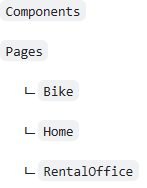

## 목표

(완료 된 사진 넣을것)
1. Section.01

&emsp; &emsp;메인 화면 컴포넌트 만들기

&emsp; &emsp; 메인 화면 만들기

2. Section.02

&emsp; &emsp; 홈 화면 만들기

&emsp; &emsp; 대여소 화면 만들기

&emsp; &emsp;화면 전환 하기

3. Section.03

&emsp; &emsp; API 연동하기

## 시작하기 전

1. git으로 내려받으실 분
> git clone https://github.com/lukewire129/bicycle-sharing-system-workshop-avaloniaTemplate.git

2. 다운로드 받으 실 분

> https://github.com/lukewire129/bicycle-sharing-system-workshop-avaloniaTemplate/releases/tag/1.0.0

다운로드 받으신 분들은 폴더 누락 되어있을텐데 아래와 같이 추가 (VisualStudio는 해당 안됨)

&emsp; &emsp;&emsp; &emsp;&emsp; &emsp;&emsp; &emsp;&emsp; &emsp;&emsp; &emsp;&emsp; &emsp;&emsp; &emsp;&emsp; &emsp;&emsp; &emsp;&emsp; &emsp;&emsp; &emsp;&emsp; &emsp;&emsp; &emsp;&emsp; &emsp;&emsp; &emsp;&emsp; &emsp;&emsp; &emsp;&emsp; &emsp;&emsp; &emsp;&emsp; &emsp;&emsp; &emsp;&emsp; &emsp;&emsp; &emsp;&emsp; &emsp;&emsp; &emsp;&emsp; &emsp;&emsp; &emsp;&emsp; &emsp;&emsp; &emsp;&emsp; &emsp;&emsp; &emsp;&emsp; &emsp;&emsp; &emsp;&emsp;[다음으로](https://github.com/blazorstudy/bicycle-sharing-system-workshop/tree/main/src/BicycleSharingSystem.Kiosk/manual/Section.01)